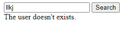

<h1 align="center" style="font-family:fantasy">🔎Find a GitHub User🔍</h1>

<h2 align="center" style="font-family: cursive">Intention 💭</h1>

This is a web-site which the users can search the someone's github profile by his/her username.

<h2 align="center" style="font-family: cursive">Back End ⚙️</h1>

It's full made on JavaScript and axios. 
First of all the user will have a search bar (input), wich he will type the person's username who he is looking for.  
 

 After that, the site will return the Profile name and the profile photo of the user.  

 If the user doesn't exist, the site will report this for the user.  

<h2 align="center" style="font-family: cursive">🚧 Front End 🖌️ Under Construction 🚧 </h1>
<h3 align="center" style="font-family: cursive">Coming Soon... </h2>

